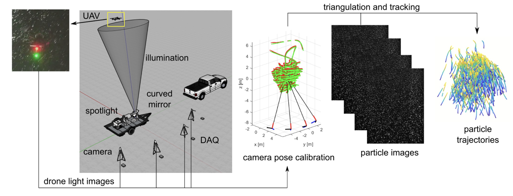
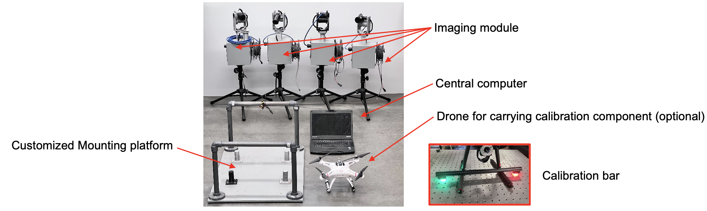

# Field 3D PTV System

This repository is the central hub for the **Field 3D PTV** system: a complete modular 3D Particle Tracking Velocimetry (PTV) solution, developed and maintained by the **[Flow Field Imaging Laboratory](https://www.jiaronghonglab.com/team), University of Minnesota**.  

**Funding:** This work was supported by the National Science Foundation under grants **NSF-MRI-2018658**.  

Most components (datasets, hardware files, and software) are hosted externally. Use the links below to access each part. If you have any questions, please contact Yue Weng at [wengy@umn.edu](mailto:wengy@umn.edu).

---

---
## **1. User Manual**

The [**User Manual (.pdf)**](Field3DPTV_v1p0_notes.pdf) provides a complete guide to the Field3DPTV system, including:  

- **Product description:** Overview of the hardware and software components  
- **Hardware:** Imaging modules, central computer, calibration modules, and optional lighting and mounting systems  
- **Software:** Remote camera control, calibration ([easyWand5](https://biomech.web.unc.edu/wand-calibration-tools/)), and the [OpenLPT](https://github.com/JHU-NI-LAB/OpenLPT_Shake-The-Box) tracking pipeline  
- **Image acquisition procedure:** Setting up the system, camera alignment, and synchronized image collection  
- **Data processing procedure:** From calibration marker extraction to particle trajectory reconstruction and visualization  
- **Demonstration cases:** Step-by-step examples for Confetti Settling, Snow Settling, and Pollen Dispersion, including calibration and tracking results  

Please read the User Manual carefully before using the demonstration cases or software modules.  

---

## **2. Hardware** 

- **Component list:** [**component list (.xlsx)**](Open3DPTV_v1p0_component_list.xlsx)  
- **2nd Generation PTV Box:** [Google Drive link](https://drive.google.com/drive/folders/15a9b34JrsrrxFkMitJ5U5t6kt57XvQb6?usp=sharing)  
- **Gimbal System:** [Google Drive link](https://drive.google.com/drive/folders/15a9b34JrsrrxFkMitJ5U5t6kt57XvQb6?usp=sharing)  

---

## **3. Software**

- **3DPTV Image Acquisition:** [Google Drive link](https://drive.google.com/drive/folders/15ao5bdWWH_cBTn2dvygWqeJexv5YywRz?usp=sharing)  
- **3DPTV Processing Pipeline:** [Google Drive link](https://drive.google.com/drive/folders/15ao5bdWWH_cBTn2dvygWqeJexv5YywRz?usp=sharing)  

---

## **4. Demonstration Cases**

- **Case I – Confetti Settling:** [Google Drive link](https://drive.google.com/drive/folders/15a2_MIlQifZ0AHN62mwUfisRs9se8s50?usp=sharing)  
- **Case II – Snow Settling:** [Google Drive link](https://drive.google.com/drive/folders/15a2_MIlQifZ0AHN62mwUfisRs9se8s50?usp=sharing)   
- **Case III – Pollen Dispersion:** [Google Drive link](https://drive.google.com/drive/folders/15a2_MIlQifZ0AHN62mwUfisRs9se8s50?usp=sharing)   

---

## **5. Papers**

[Bristow, N., Li, J., Hartford, P., Guala, M., & Hong, J. (2023). Imaging-based 3D particle tracking system for field characterization of particle dynamics in atmospheric flows. Experiments in Fluids, 64(4), 78.](papers/bristow2023ef.pdf)

[Li, J., Guala, M., & Hong, J. (2024). Field investigation of 3-D snow settling dynamics under weak atmospheric turbulence. Journal of Fluid Mechanics, 997, A33.](papers/li2024jfm.pdf)
